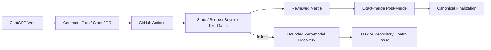

# Generic Devflow Scaffold

面向 **ChatGPT Web 监督**与**确定性 GitHub Actions 执行**的通用仓库脚手架。

## 从这里开始

- **新建仓库、首次配置、Workflow 架构图和完整操作说明：**
  [`docs/USAGE.md`](docs/USAGE.md)
- 执行政策、Runbook 和模板索引：
  [`docs/process/README.md`](docs/process/README.md)
- 启动第一个任务：
  [`docs/process/runbooks/start-new-task.md`](docs/process/runbooks/start-new-task.md)

脚手架将以下职责分离：

- ChatGPT Web 负责需求理解、合同、计划、实现、诊断、PR 和业务决策；
- 仓库中的 `task_state.yaml` 是唯一 canonical task state；
- GitHub Actions 负责状态、范围、安全、测试、有限恢复、通知和 Post-Merge；
- 可选 Agent/Codex 执行面默认硬禁用，只保留零模型资格复核边界。

本仓库不包含产品实现。将产品代码放入 `src/` 或项目自己的目录，并在
`.devflow/gate-profiles.json` 中定义由默认分支拥有的可信命令参数数组。

## 安全默认值

| 能力 | 默认值 |
|---|---|
| 模型调用 | disabled |
| 自动合并 | disabled |
| 付费 Relay 探针 | disabled / zero requests |
| 分支删除 | dry-run |
| 基础设施重试 | 有界且先分类 |
| Secret-bearing 自动发布 | 不存在 |
| 第三方 Actions | 固定完整 commit SHA |

## 新项目最短路径

1. 把本仓库设置为 GitHub Template Repository，或干净复制仓库内容；
2. 修改 `.devflow/project.json` 中的用户、分支、路径和功能开关；
3. 修改 `.devflow/gate-profiles.json`，加入产品安装、Lint、测试和必要 E2E；
4. 启用 Issues，并配置 Actions 所需的读写权限；
5. 用初始化 PR 跑通 Test、State Consistency 和 Upgrade Compatibility；
6. 按任务模板创建第一个 Task Control Issue、canonical state 和 Draft PR。

完整步骤与图示见 [`docs/USAGE.md`](docs/USAGE.md)。

## 本地验证

```bash
python -m pip install -e ".[dev]"
python -m compileall -q scripts tests
python scripts/devflow/validate_docs.py
python scripts/devflow/validate_workflows.py
python scripts/devflow/validate_state.py --all-active --no-git
python scripts/devflow/upgrade_compatibility.py
ruff check scripts tests
pytest -q tests
```

## 架构摘要


