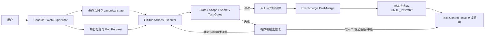
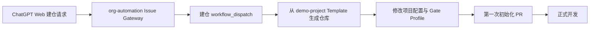
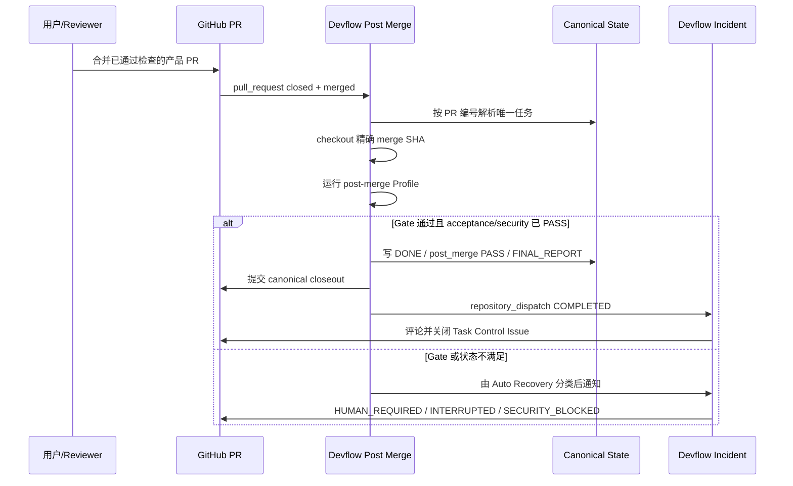
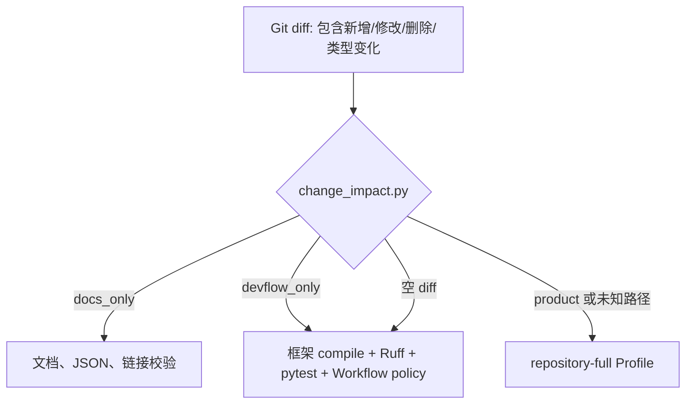
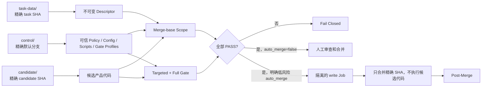
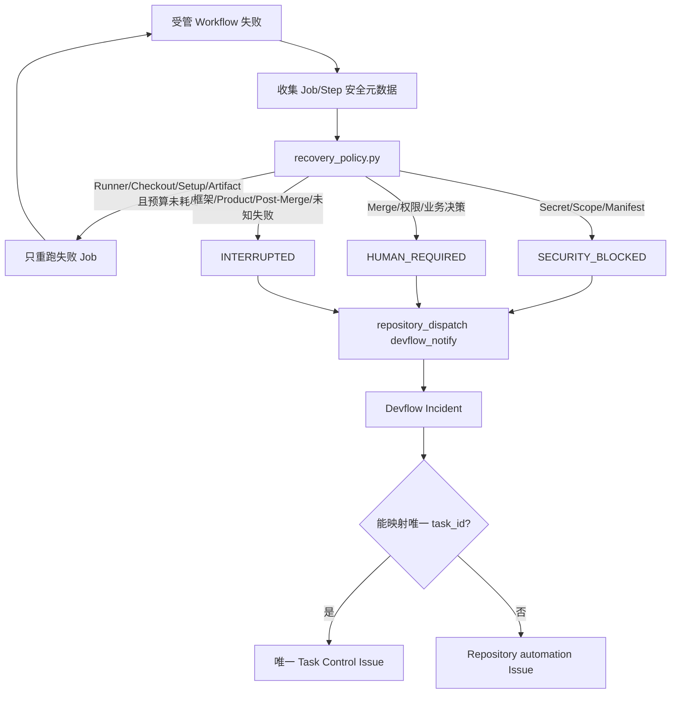

# 通用 Devflow 脚手架使用说明

本文说明如何把本仓库作为新项目的执行脚手架，以及脚手架如何通过
GitHub Actions 自动控制任务状态、质量门禁、失败恢复、合并后验证和通知。

> 这不是某一种业务或编程语言的项目模板。Python 只用于执行框架本身的
> 确定性校验；产品代码可以是 Python、Node.js、Go、Rust、Java 或混合技术栈。

## 1. 脚手架解决什么问题

脚手架把一个复杂开发任务拆成两个明确的执行面：

- **ChatGPT Web Supervisor**：理解需求、建立任务合同、拆工作包、修改代码、
  诊断失败、维护 PR，并处理真正需要人工判断的事情；
- **GitHub Actions Executor**：运行可重复的状态、范围、安全、测试、合并后
  验证、有限恢复和 Issue 通知。

GitHub 仓库中的版本化状态是唯一可信状态。聊天内容、浏览器动画和临时日志
都不是任务状态源。



## 2. 用本仓库创建一个新项目

### 2.1 推荐方式：GitHub Template Repository

第一次需要仓库管理员做一次设置：

1. 打开本仓库的 **Settings → General**；
2. 勾选 **Template repository**；
3. 保存。

以后创建项目时：

1. 打开本仓库首页；
2. 点击 **Use this template → Create a new repository**；
3. 选择目标 Owner，例如 `BullbaseGuy`；
4. 填写新仓库名称、描述和可见性；
5. 只复制默认分支即可；
6. 创建仓库后继续执行本文第 3 节。

使用 GitHub CLI 时可采用：

```bash
gh repo create BullbaseGuy/my-new-project \
  --private \
  --template BullbaseGuy/demo-project \
  --clone
```

模板仓库设置尚未启用时，先在 GitHub 网页启用，或者使用下一节的普通 Git
复制方式。

### 2.2 不使用 Template 功能：复制仓库内容

```bash
git clone https://github.com/BullbaseGuy/demo-project.git my-new-project
cd my-new-project
rm -rf .git
git init -b main
git remote add origin https://github.com/BullbaseGuy/my-new-project.git
git add .
git commit -m "chore: initialize project from generic devflow scaffold"
git push -u origin main
```

Windows PowerShell 删除旧 Git 历史时使用：

```powershell
Remove-Item -Recurse -Force .git
git init -b main
```

### 2.3 接入现有的 `org-automation`

当本仓库已经被标记为 Template Repository 后，组织建仓 Workflow 可以使用
GitHub 的模板生成接口，而不是先创建空仓库再逐个写入文件：

```bash
gh api \
  --method POST \
  /repos/BullbaseGuy/demo-project/generate \
  -f owner="BullbaseGuy" \
  -f name="$REPOSITORY_NAME" \
  -f description="$REPOSITORY_DESCRIPTION" \
  -F private=true \
  -F include_all_branches=false
```

这样从 ChatGPT Web 发起的建仓 Issue 可以直接生成一个已经带完整 Devflow 的
新仓库。模板仓库与建仓控制仓库应保持职责分离：



## 3. 新仓库必须完成的初始化配置

新仓库创建后，不要立即开始产品开发。先通过一个初始化 PR 完成下面的配置。

### 3.1 修改 `.devflow/project.json`

这是仓库级执行策略的唯一配置入口。

```json
{
  "schema_version": 1,
  "project": {
    "default_branch": "main",
    "allowed_actors": ["your-github-login"],
    "notification_mentions": ["your-github-login"],
    "python_version": "3.12"
  },
  "branches": {
    "work_prefix": "feature/",
    "task_data_prefix": "task/agent-",
    "publish_prefix": "agent/"
  },
  "features": {
    "automatic_merge": false,
    "agent_execution": "disabled",
    "relay_paid_probe": false,
    "branch_gc_execute": false
  }
}
```

配置项含义：

| 配置 | 用途 | 推荐初值 |
|---|---|---|
| `default_branch` | canonical state 所在默认分支 | `main` |
| `allowed_actors` | 可手工启动高风险 Workflow 的 GitHub 用户 | 仓库维护者 |
| `notification_mentions` | Task Control Issue 中提醒的人 | 仓库维护者 |
| `python_version` | Devflow 编排脚本使用的 Python | `3.12` |
| `work_prefix` | 普通 ChatGPT Web 工作分支 | `feature/` |
| `task_data_prefix` | 可选 Agent 的只读任务描述分支 | `task/agent-` |
| `publish_prefix` | 可选 Agent 的候选代码分支 | `agent/` |
| `automatic_merge` | 是否允许满足严格条件的低风险自动合并 | `false` |
| `agent_execution` | 是否启用模型执行面 | `disabled` |
| `relay_paid_probe` | 是否允许付费 Relay 探针 | `false` |
| `branch_gc_execute` | Branch GC 是否真正删除分支 | `false` |

`paths` 中的三组规则也必须按项目调整：

- `docs_only`：只需文档校验的路径；
- `framework`：修改后必须运行 Devflow 框架 Gate 的路径；
- `protected`：可选 Agent 候选绝不能修改的控制、状态、Secret 和迁移路径。

未知配置字段、路径穿越和不安全 Git ref 会 Fail Closed，而不是被静默忽略。

### 3.2 修改 `.devflow/gate-profiles.json`

Gate Profile 是受默认分支控制的可信命令清单。每条命令必须写成参数数组：

```json
["python", "-m", "pytest", "-q"]
```

不要写成 Shell 字符串，也不要使用：

```json
["bash", "-c", "任意文本命令"]
```

框架会拒绝常见 Shell 解释器，避免任务描述或 Issue 文本变成任意命令入口。

#### Python 项目示例

```json
{
  "repository-full": [
    ["python", "-m", "compileall", "-q", "src", "tests"],
    ["ruff", "check", "src", "tests"],
    ["pytest", "-q"]
  ],
  "post-merge": [
    ["ruff", "check", "src", "tests"],
    ["pytest", "-q"]
  ]
}
```

#### Node.js 项目示例

```json
{
  "repository-full": [
    ["npm", "ci"],
    ["npm", "run", "lint"],
    ["npm", "test"]
  ],
  "post-merge": [
    ["npm", "ci"],
    ["npm", "test"]
  ]
}
```

#### Go 项目示例

```json
{
  "repository-full": [
    ["go", "test", "./..."],
    ["go", "vet", "./..."]
  ],
  "post-merge": [
    ["go", "test", "./..."]
  ]
}
```

保留下面四个稳定 Profile 名称，或者同步修改使用它们的模板和 Workflow：

- `devflow-targeted`；
- `repository-full`；
- `post-merge`；
- `agent-targeted`。

产品依赖的安装步骤也应作为受信命令写入 Profile，或者在项目自己的只读测试
Workflow 中完成。不要从任务描述文件读取并执行命令。

### 3.3 修改项目依赖和目录

- 保留 `scripts/devflow/`、`.devflow/`、`docs/process/` 和相关测试；
- 将 `pyproject.toml` 的项目名称和产品依赖改成新项目内容；
- Devflow 至少需要 `pytest` 和 `ruff`；
- 非 Python 产品仍保留最小 Python 环境，因为状态和安全校验脚本使用 Python；
- 将 `src/.gitkeep` 替换为真实产品目录。

### 3.4 GitHub 仓库设置

#### Issues

启用 **Issues**。每个复杂任务使用一个唯一的：

```text
[TASK CONTROL] <task-id>
```

框架级、无法归属具体任务的失败会进入：

```text
[DEVFLOW CONTROL] Repository automation
```

#### Actions 权限

进入：

```text
Settings → Actions → General → Workflow permissions
```

选择 **Read and write permissions**。原因是：

- Auto Recovery 需要重跑普通基础设施失败 Job；
- Incident Workflow 需要更新 Issue；
- Post-Merge 需要提交 canonical state 和 `FINAL_REPORT.md`；
- 可选自动合并和 Branch GC 需要写入仓库。

默认脚手架不会让 Workflow 自动创建或批准产品 PR，因此“Allow GitHub Actions to
create and approve pull requests”可以保持关闭。

#### 默认分支规则

第一次初始化 PR 通过后，在 Ruleset 或 Branch Protection 中选择实际出现的
稳定检查，通常包括：

- `Test / test`；
- `Devflow State Consistency / consistency`；
- `Devflow Upgrade Compatibility / compatibility`。

`Devflow Post Merge` 会在产品 PR 合并后向默认分支写入一次只包含
`docs/implementation/**` 的 canonical closeout 提交。如果默认分支规则禁止
GitHub Actions 的所有直接写入，这一步会安全失败并发出 `HUMAN_REQUIRED` 或
`INTERRUPTED` 通知。此时有两种选择：

1. 为受信任的 GitHub Actions 身份配置仅限 closeout 的规则绕过；
2. 保持禁止，并根据通知手工提交相同的 canonical closeout。

不要通过关闭所有安全规则来解决权限问题。

### 3.5 第一次初始化 PR

初始化 PR 至少运行并通过：

```bash
python -m compileall -q scripts tests
python scripts/devflow/validate_docs.py
python scripts/devflow/validate_workflows.py
python scripts/devflow/validate_state.py --all-active --no-git
python scripts/devflow/upgrade_compatibility.py
ruff check scripts tests
pytest -q tests
```

此时 `docs/implementation/ACTIVE_TASKS.yaml` 应保持空任务列表。

## 4. 标准任务如何运行

默认执行路径不调用模型，也不要求额外 Secret。

### 4.1 创建任务

假设任务 ID 是 `add-user-api`：

1. 从最新默认分支创建 `feature/add-user-api`；
2. 将 `docs/process/templates/` 中的文件复制到：

   ```text
   docs/implementation/add-user-api/
   ```

3. 至少建立：

   ```text
   00_contract.md
   01_master_plan.md
   task_state.yaml
   STATUS.md
   HANDOFF.md
   DECISIONS.md
   W00_plan.md
   ```

4. 在 `ACTIVE_TASKS.yaml` 加入任务；
5. 创建 `[TASK CONTROL] add-user-api` Issue；
6. 把 Issue 编号写入 `task_state.yaml.notification.control_issue_number`；
7. 创建 Draft PR，并把 PR 编号同步到 task state 和 active-task index。

标准 ChatGPT Web 路径的索引示例：

```json
{
  "task_id": "add-user-api",
  "title": "Add user API",
  "status": "RUNNING",
  "branch": "feature/add-user-api",
  "task_branch": null,
  "publish_branch": null,
  "pull_request": 12,
  "current_stage": "W00",
  "post_merge_profile": "post-merge",
  "notify_completion": true,
  "state_path": "docs/implementation/add-user-api/task_state.yaml"
}
```

### 4.2 工作包纪律

每个工作包必须遵守：

```text
Wxx_plan.md
→ 实现
→ 定向验证
→ 完整验证（按影响级别）
→ Wxx_result.md
→ 更新 task_state.yaml
→ 进入下一个工作包
```

不要先实现再补计划。不要在 Gate 失败时把结果文件写成已完成。

### 4.3 合并前状态

产品 PR 准备合并时，canonical state 至少满足：

```json
{
  "status": "VERIFYING",
  "execution_status": "COMPLETED",
  "acceptance": {
    "domain": "generic",
    "status": "PASS",
    "reason_code": null,
    "details_path": null
  },
  "security_status": "PASS",
  "human_gate": {
    "required": false,
    "reason": null,
    "minimum_action": null,
    "resume_from": null
  },
  "post_merge": {
    "status": "PENDING",
    "merge_sha": null,
    "verified_run_ids": []
  }
}
```

`acceptance.status` 和 `security_status` 必须由真实验收结果决定。Post-Merge
Finalizer 不会为了得到绿灯而把它们强制改成 `PASS`。

### 4.4 合并后的自动收尾



只有精确合并提交验证通过、canonical state 写入 `DONE`、最终报告存在，任务才算
真正完成。

## 5. Workflow 自动控制架构

### 5.1 Workflow 总览

| Workflow | 触发方式 | 主要职责 | 默认写权限 |
|---|---|---|---|
| `Test` | push、PR、手工 | 影响分类、文档/框架/产品 Gate | 无 |
| `Devflow State Consistency` | push、PR、手工 | 校验全部任务索引、状态、文档、Workflow | 无 |
| `Devflow Upgrade Compatibility` | push、PR、手工 | 状态和 Descriptor 版本兼容矩阵 | 无 |
| `Devflow Product Gate` | dispatch、手工 | 可选 Agent 候选的 Scope、Targeted、Full Gate | Gate 无；通知/合并隔离写权限 |
| `Devflow Post Merge` | PR 合并、dispatch、手工 | 精确 merge 验证、canonical finalization | Finalize Job 写内容 |
| `Devflow Auto Recovery` | 受管 Workflow 完成且失败 | 分类、有限基础设施重跑、终态通知 | Actions 和 Contents 写 |
| `Devflow Incident` | 已分类 `repository_dispatch` | 去重写入 Task/Repository Control Issue | Issues 写 |
| `Devflow Branch Garbage Collection` | dispatch、手工 | 生成受管分支清理计划，默认 Dry Run | 可选 Contents 写 |
| `Devflow Secret Audit` | 手工 | 扫描已跟踪文件的高置信 Secret 特征 | 无 |
| `Codex Candidate Review` | 手工 | 精确任务 SHA 的零模型资格复核 | 无 |
| `Devflow Relay Health` | 手工 | 零请求配置检查 | 无 |
| `Devflow Legacy Codex Rerun Audit` | 周期、分支创建、手工 | 证明历史 task 分支仍是 data-only | 无 |

### 5.2 Test 的影响感知路由



规则是保守升级：未知路径和混合路径不会降级成轻量测试；删除文件也会进入影响
和 Scope 计算，不能通过删除受保护文件绕过门禁。

### 5.3 可信控制平面与候选代码隔离

`Devflow Product Gate` 只用于可选的不可变 Agent 候选。它采用三个独立 Checkout：



关键边界：

- 候选分支不能提供自己的 Gate 脚本或 Gate Profile；
- Scope 和命令都来自精确默认分支；
- Gate Job 只有读权限；
- 写权限只存在于不执行候选代码的 Merge Job；
- 默认配置同时关闭 Agent 执行和自动合并。

### 5.4 失败恢复与通知



Auto Recovery 不会：

- 自动调用 Codex 或其他模型；
- 自动重跑付费探针；
- 自动修复业务代码；
- 在 Scope/Secret/Manifest 失败后继续；
- 从 Issue 自由文本执行命令。

### 5.5 通知去重

通知去重键为：

```text
task_id + root-cause fingerprint + notification_type
```

同一根因的多个 Workflow 失败不会重复刷屏。`/ack` 只表示已经看到通知，不能
触发修复、重试或状态变化。

## 6. 可选 Agent/Codex 执行面

默认状态：

```text
agent_execution = disabled
codex policy = disabled
model invocation = 0
automatic second session = 0
recovery generation = 0
paid relay requests = 0
```

常驻 `Codex Candidate Review` 只会：

1. 校验调用者；
2. 校验 task branch 前缀和精确 SHA；
3. 从默认分支读取可信 Policy；
4. 把任务分支当作 data-only 输入；
5. 校验 Descriptor 和 Context Budget；
6. 输出 `BLOCKED` 或资格结论；
7. 明确记录 `CODEX_MODEL_INVOCATION=DISABLED`。

真正启用模型必须是一个独立、受审、一次性的 Activation PR，并绑定：

- 一个 task commit SHA；
- 一个失败 fingerprint；
- 不超过预算的允许文件；
- 一个短 TTL Grant；
- 最多一次调用；
- 不可自动重跑。

不要只把 `agent_execution` 改为 `enabled` 就认为模型链路已经安全启用。

## 7. 常见问题

### 7.1 PR Check 通过，但任务没有变成 DONE

检查：

- 产品 PR 是否真的已合并；
- `ACTIVE_TASKS.yaml` 中 PR 编号是否准确；
- `task_state.yaml` 的 `acceptance.status` 和 `security_status` 是否为 `PASS`；
- 当前 `Wxx_result.md` 是否存在；
- `Devflow Post Merge` 是否能向默认分支写 canonical closeout；
- Post-Merge Profile 是否通过。

### 7.2 Post-Merge 无法 push

这是权限或分支规则边界，不应强推。查看 Task Control Issue 的最小人工动作，配置
受限的 Actions 绕过，或者手工提交生成的 closeout 内容。

### 7.3 文档修改为什么触发框架测试

`docs/process/**` 和 `docs/implementation/**` 属于执行合同和 canonical state，不能
被当作普通文档。只有普通 README/说明文档才可能被分类为 `docs_only`。

### 7.4 新增技术栈后测试没有运行

在 `.devflow/gate-profiles.json` 中加入安装、Lint、单元测试和必要 E2E 命令，并把
对应产品路径保持在 `product` 分类。未知路径默认已经按 `product` 处理。

### 7.5 Secret Audit 输出为什么不显示文件和命中值

这是有意设计。Artifact 和日志只报告命中数量和类型，不复制 Secret、上下文或
附近字节。修复时在本地安全环境中检查变更，不要把值贴到 Issue 或聊天中。

### 7.6 能不能让 Branch GC 自动删除分支

可以，但默认 `branch_gc_execute=false`。先长期观察 Dry Run 计划。启用后仍会保护：

- 未完成任务的普通工作分支；
- 未完成任务的 task-data 分支；
- 未完成任务的 publish 分支；
- 仍有开放 PR 的分支；
- 不属于受管前缀的分支。

## 8. 升级脚手架

不要把本仓库的新版本直接覆盖到业务仓库。正确做法：

1. 在业务仓库创建 `chore/devflow-upgrade-*` 分支；
2. 只同步 `.devflow/`、`scripts/devflow/`、`docs/process/`、相关 Workflow 和测试；
3. 保留业务仓库自己的 Gate Profile 和路径策略；
4. 运行 Upgrade Compatibility；
5. 检查未知 Schema 是否 Fail Closed；
6. 通过 PR 合并；
7. 在精确合并提交上重新执行 State Consistency 和完整测试。

升级不得重新打开已经完成的历史任务，也不得覆盖历史证据。

## 9. 新项目上线检查表

- [ ] 仓库由 Template 或干净复制方式创建；
- [ ] `.devflow/project.json` 的用户、分支和路径已改；
- [ ] `.devflow/gate-profiles.json` 已覆盖实际技术栈；
- [ ] 产品依赖和 `pyproject.toml` 已更新；
- [ ] Issues 已启用；
- [ ] Actions 已配置必要的读写权限；
- [ ] 分支规则和 Post-Merge closeout 权限已验证；
- [ ] `ACTIVE_TASKS.yaml` 初始为空；
- [ ] Ruff、pytest、文档、Workflow、State、Compatibility 全部通过；
- [ ] 第一个真实任务按标准路径建立了合同、State、Issue 和 Draft PR；
- [ ] Agent、自动合并、付费探针和 Branch GC 执行仍保持默认关闭，除非经过单独审查。
